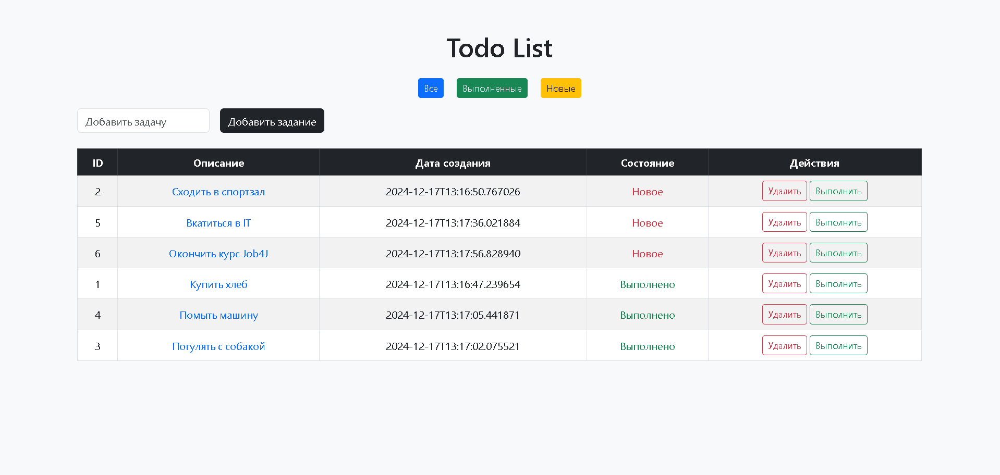

**Описание**  
Приложение "TODO список" для управления задачами. Реализовано с использованием стека технологий:  
Spring Boot, Thymeleaf, Hibernate, PostgreSQL и Bootstrap.

## **Функционал**
1. Добавление новых заданий.
2. Отображение всех заданий, выполненных и новых.
3. Редактирование и удаление заданий.
4. Пометка задания как "выполненное".
5. Подробное отображение описания задачи.

## **Стек технологий**
- **Backend:** Spring Boot, Hibernate
- **Frontend:** Thymeleaf, Bootstrap
- **База данных:** PostgreSQL
- **Сборка:** Maven
- **Миграции:** Liquibase

## **Скриншоты**
Добавьте здесь изображения запущенного приложения (список задач, формы и т.д.).
### Главная страница

### Список выполненных задач

### Список новых задач

### Подробное описание задачи

### Редактировать задачу

